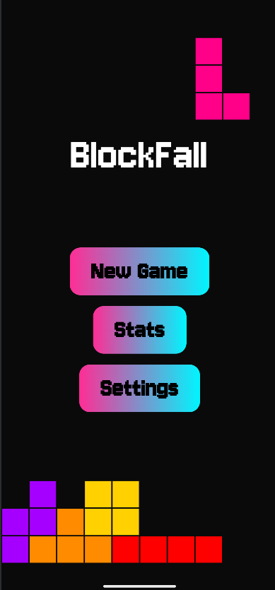
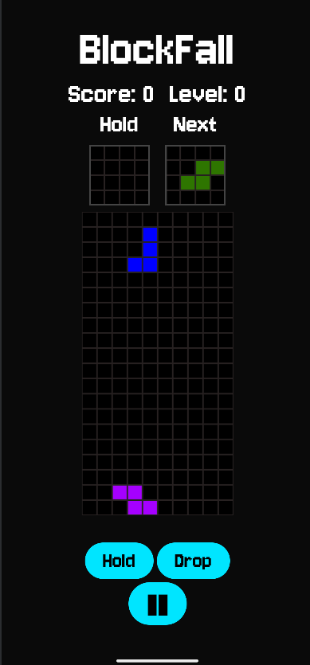
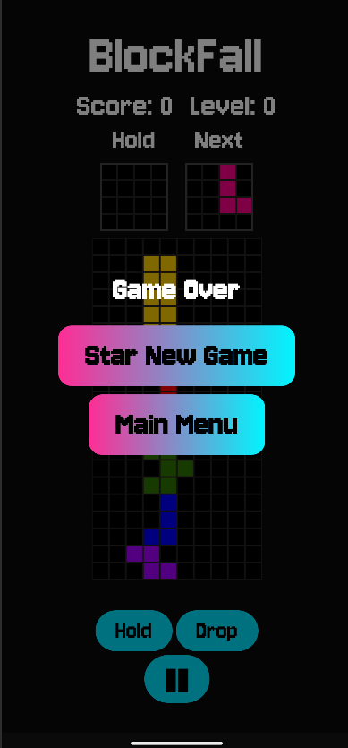

# Falling Blocks


A modern falling blocks puzzle game for Android, built using Kotlin and Jetpack Compose.

## Features

- Classic falling blocks gameplay with next, hold, and drop mechanics.
- Score, level, combo, and cleared line tracking.
- Pause and resume functionality.
- Smooth animations and responsive controls using Jetpack Compose.
- Game over detection and level progression.
- Designed with modular `GameEngine` and `GameViewModel` for easy testing and future expansion.

## Key Learnings

- Implemented core game logic in a modular and testable `GameEngine`.
- Managed game state and UI updates efficiently using `ViewModel` and `StateFlow`.
- Applied Kotlin coroutines for smooth, timed game loops.
- Built responsive UI with Jetpack Compose, including animations and user interactions.
- Handled audio focus: game pauses or lowers volume when music/other sounds play or on phone calls.
- Implemented touch input handling for intuitive mobile controls (swipe, tap, drag).
- Learned to structure an Android project for unit testing and clean architecture.

## Architecture

- **GameEngine**: Handles the core game logic including block movement, rotation, line clearing, scoring, and level progression.
- **GameViewModel**: Maintains game state using `StateFlow` and manages the main game loop with coroutines.
- **Board & Block**: Represent the grid and pieces respectively.

## Screenshots



1. Main Menu



2. Game Screen



3. Game Over Screen

## Getting Started

### Requirements

- Android Studio Bumblebee or later.
- Kotlin 2.x
- Android SDK 26+
- Gradle 8.x

### Running the Project

1. Clone the repository:

   ```bash
   git clone git@github.com:Aliceterrick/BlockFall-Android-Game.git
   ```
2. Open the project in Android Studio.

3. Let Android Studio sync Gradle.

4. Run on an emulator or physical device.

### Testing

Unit tests are located in src/test/java.

## Audio

.wav files used in this app are from open sources. Some of them have been remastered by [Judikael](https://judikaelarchives.neocities.org/).